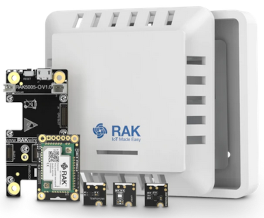

----
----
# _WORK IN PROGRESS_
----
----

# RAK4631-Kit-1-RAK1901-RAK1902-RAK1903
|  |  |  |    
| :-: | :-: | :-: |     

This is an example code for WisBlock Weather Kit with the RAK1901, RAK1902 and RAK1903. 

## _REMARK 1_
This example is using my [WisBlock API-V2](https://github.com/beegee-tokyo/WisBlock-API-V2) ⤴️ which helps to create low power consumption application and taking the load to handle communications from your shoulder. 

----

# Hardware used
- [RAK4631](https://docs.rakwireless.com/Product-Categories/WisBlock/RAK4631/Overview/) WisBlock Core module
- [RAK19007](https://docs.rakwireless.com/Product-Categories/WisBlock/RAK19007/Overview/) WisBlock Base board
- [RAK1901](https://docs.rakwireless.com/Product-Categories/WisBlock/RAK1901/Overview/) WisBlock Temperature and Humidty Sensor
- [RAK1902](https://docs.rakwireless.com/Product-Categories/WisBlock/RAK1902/Overview/) WisBlock Barometer Pressure Sensor
- [RAK1903](https://docs.rakwireless.com/Product-Categories/WisBlock/RAK1903/Overview/) WisBlock Ambient Light Sensor

## _REMARK_
All of these modules can be bought together with a matching enclosure as [WisBlock Kit 1](https://store.rakwireless.com/collections/kits-bundles/products/wisblock-kit-1-weather-monitor) ⤴️

## Power consumption
The MCU and LoRa transceiver go into sleep mode between measurement cycles to save power. I could measure a sleep current of 40uA of the whole system. 

----

# Software used
- [PlatformIO](https://platformio.org/install) ⤴️
- [Adafruit nRF52 BSP](https://docs.platformio.org/en/latest/boards/nordicnrf52/adafruit_feather_nrf52832.html) ⤴️
- [Patch to use RAK4631 with PlatformIO](https://github.com/RAKWireless/WisBlock/blob/master/PlatformIO/RAK4630/README.md) ⤴️
- [SX126x-Arduino LoRaWAN library](https://github.com/beegee-tokyo/SX126x-Arduino) ⤴️
- [SparkFun SHTC3 Humidity and Temperature Sensor Library](https://platformio.org/lib/show/6539/SparkFun%20SHTC3%20Humidity%20and%20Temperature%20Sensor%20Library/installation) ⤴️
- [Adafruit LPS2X](https://platformio.org/lib/show/7084/Adafruit%20LPS2X) ⤴️
- [ClosedCube OPT3001](https://platformio.org/lib/show/838/ClosedCube%20OPT3001) ⤴️
- [WisBlock-API-V2](https://platformio.org/lib/show/12807/WisBlock-API-V2) ⤴️

## _REMARK_
The libraries are all listed in the **`platformio.ini`** and are automatically installed when the project is compiled.

----

# Setting up LoRaWAN credentials
The LoRaWAN settings can be defined in three different ways. 
- Over BLE with [WisBlock Toolbox](https://play.google.com/store/apps/details?id=tk.giesecke.wisblock_toolbox) ⤴️
- Over USB with [AT Commands](./AT-Commands.md)
- Hardcoded in the sources (_**ABSOLUTELY NOT RECOMMENDED**_)

## 1) Setup over BLE
Using the [WisBlock Toolbox](https://play.google.com/store/apps/details?id=tk.giesecke.wisblock_toolbox) ⤴️ you can connect to the WisBlock over BLE and setup all LoRaWAN parameters like
- Region
- OTAA/ABP
- Confirmed/Unconfirmed message
- ...

More details can be found in the [WisBlock Toolbox](https://play.google.com/store/apps/details?id=tk.giesecke.wisblock_toolbox) ⤴️

The device is advertising over BLE only the first 30 seconds after power up and then again for 15 seconds after wakeup for measurements. The device is advertising as **`RAK-GNSS-xx`** where xx is the BLE MAC address of the device.

## 2) Setup over USB port
Using the AT command interface the WisBlock can be setup over the USB port.

A detailed manual for the AT commands are in the [AT-Command-Manual](https://docs.rakwireless.com/product-categories/software-apis-and-libraries/rui3/at-command-manual) ⤴️

Here is an example for the typical AT commands required to get the device ready (EUI's and Keys are examples):
```log
// Setup AppEUI
AT+APPEUI=70b3d57ed00201e1
// Setup DevEUI
AT+DEVEUI=ac1f09fffe03efdc
// Setup AppKey
AT+APPKEY=2b84e0b09b68e5cb42176fe753dcee79
// Set automatic send interval in seconds
AT+SENDINT=60
// Set data rate
AT+DR=3
// Set LoRaWAN region (here US915)
AT+BAND=5
// Reset node to save the new parameters
ATZ
// After reboot, start join request
AT+JOIN=1,0,8,10
```

## _REMARK_
The AT command format used here is _**NOT**_ compatible with the RAK5205/RAK7205 AT commands.

## 3) Hardcoded LoRaWAN settings
`void api_read_credentials(void);`    
`void api_set_credentials(void);`
If LoRaWAN credentials need to be hardcoded (e.g. the region, the send repeat time, ...) this can be done in `setup_app()`.
First the saved credentials must be read from flash with `api_read_credentials();`, then credentials can be changed. After changing the credentials must be saved with `api_set_credentials()`.
As the WisBlock API checks if any changes need to be saved, the changed values will be only saved on the first boot after flashing the application.     
Example:    
```c++
// Read credentials from Flash
api_read_credentials();
// Make changes to the credentials
g_lorawan_settings.send_repeat_time = 240000;                   // Default is 2 minutes
g_lorawan_settings.subband_channels = 2;                        // Default is subband 1
g_lorawan_settings.app_port = 4;                                // Default is 2
g_lorawan_settings.confirmed_msg_enabled = LMH_CONFIRMED_MSG;   // Default is UNCONFIRMED
g_lorawan_settings.lora_region = LORAMAC_REGION_AS923_3;		// LoRa region
// Save hard coded LoRaWAN settings
api_set_credentials();
```

_**REMARK 1**_    
Hard coded credentials must be set in `void setup_app(void)`!

_**REMARK 2**_    
Keep in mind that parameters that are changed from with this method can be changed over AT command or BLE _**BUT WILL BE RESET AFTER A REBOOT**_!

_**REMARK 3**_    
The data encoding is based on Cayenne LPP sensor ID's. This makes it very easy to visualize the sensor data in myDevices Cayenne.

----

# Compiled output
The compiled files are located in the [./Generated](./Generated) folder. Each successful compiled version is named as      
**`WisBlock_WEA_Vx.y.z_YYYYMMddhhmmss`**    
x.y.z is the version number. The version number is setup in the [./platformio.ini](./platformio.ini) file.    
YYYYMMddhhmmss is the timestamp of the compilation.

The generated **`.zip`** file can be used as well to update the device over BLE using either [WisBlock Toolbox](https://play.google.com/store/apps/details?id=tk.giesecke.wisblock_toolbox) or [Nordic nRF Toolbox](https://play.google.com/store/apps/details?id=no.nordicsemi.android.nrftoolbox) or [nRF Connect](https://play.google.com/store/apps/details?id=no.nordicsemi.android.mcp)

----

# Debug options 
Debug output can be controlled by defines in the **`platformio.ini`**    
_**LIB_DEBUG**_ controls debug output of the SX126x-Arduino LoRaWAN library
 - 0 -> No debug outpuy
 - 1 -> Library debug output (not recommended, can have influence on timing)    

_**MY_DEBUG**_ controls debug output of the application itself
 - 0 -> No debug outpuy
 - 1 -> Application debug output

_**CFG_DEBUG**_ controls the debug output of the nRF52 BSP. It is recommended to keep it off

## Example for no debug output and maximum power savings:

```ini
[env:wiscore_rak4631]
platform = nordicnrf52
board = wiscore_rak4631
framework = arduino
build_flags = 
	; -DCFG_DEBUG=2
	-DSW_VERSION_1=1 ; major version increase on API change / not backwards compatible
	-DSW_VERSION_2=0 ; minor version increase on API change / backward compatible
	-DSW_VERSION_3=0 ; patch version increase on bugfix, no affect on API
	-DLIB_DEBUG=0    ; 0 Disable LoRaWAN debug output
	-DMY_DEBUG=0     ; 0 Disable application debug output
	-DNO_BLE_LED=1   ; 1 Disable blue LED as BLE notificator
lib_deps = 
	beegee-tokyo/SX126x-Arduino
	beegee-tokyo/WisBlock-API-V2
	sparkfun/SparkFun SHTC3 Humidity and Temperature Sensor Library
	adafruit/Adafruit LPS2X
	closedcube/ClosedCube OPT3001
extra_scripts = pre:rename.py
```